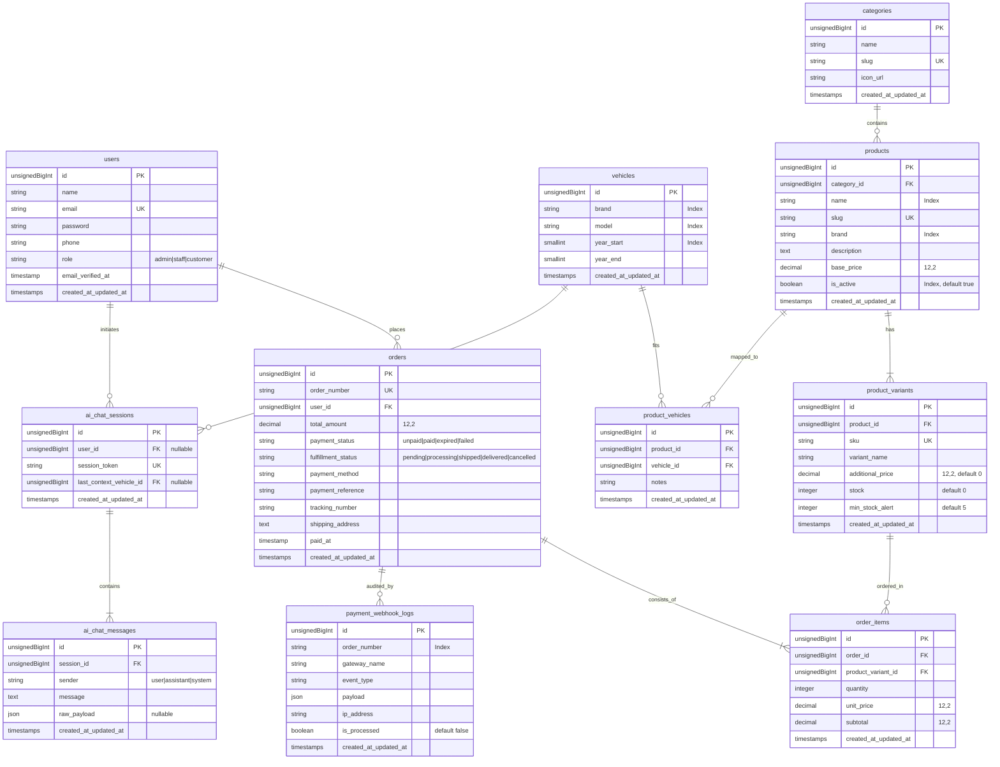
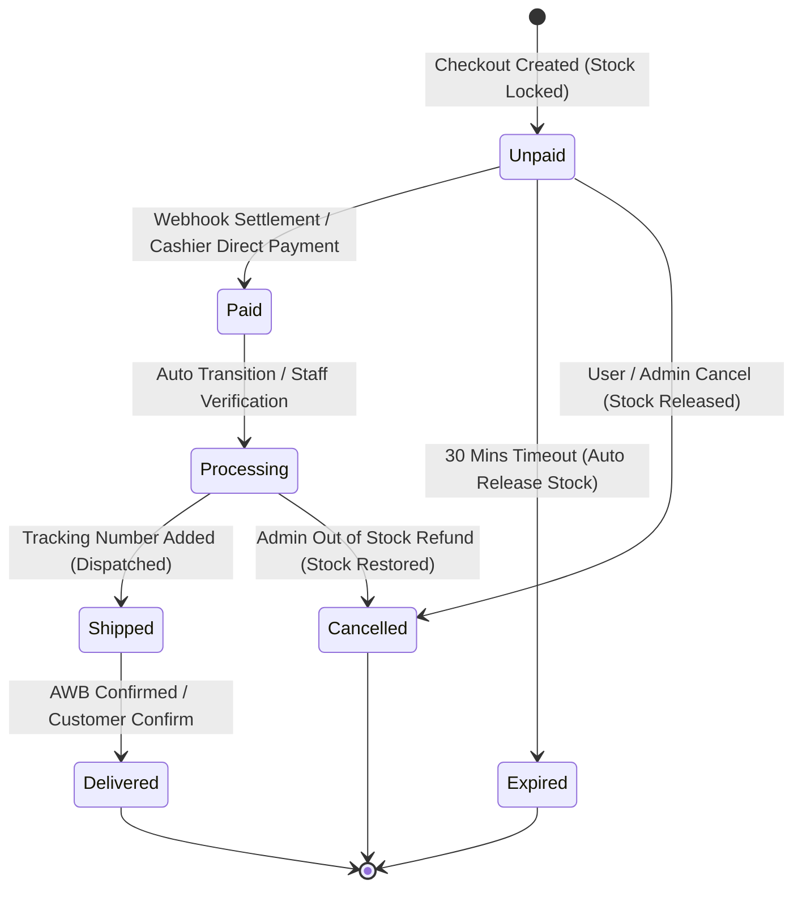
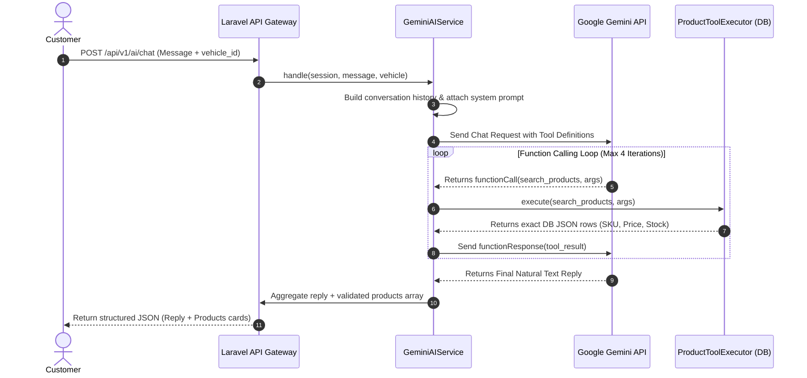

# Product Requirement Document (PRD)
**Project Name:** MotoVault (Smart Automotive Parts & Accessories Platform)  
**Version:** 1.1.0 (Production-Ready Technical PRD)  
**Target Tech Stack:** Laravel 11 (PHP 8.3+), MySQL 8.0+, Redis 7.0+, Laravel Sanctum, Spatie Permission, Google Gemini API / OpenAI API, Midtrans / Xendit Gateway  
**Document Status:** Approved / Ready for Implementation  

---

## 1. Executive Summary & Problem Statement

### 1.1. Problem Statement
Membeli suku cadang (*spare parts*), oli, aki, busi, helm, dan aksesori otomotif secara daring maupun di toko fisik sering menimbulkan kebingungan bagi konsumen akibat tingginya risiko ketidakcocokan spesifikasi teknis (*compatibility mismatch*). Ketidakcocokan ini mencakup:
* Perbedaan tipe soket aki & kapasitas daya (misal: GTZ-5S vs GTZ-6V untuk sistem *Idling Stop*).
* Ukuran ulir dan nilai panas busi (misal: busi standar vs iridium tipe *long reach*).
* Dudukan kaliper & piringan rem (cakram floating vs non-floating, perbedaan diameter bracket).
* Dimensi helm & *fitting cheek pad* (lingkar kepala cm vs ukuran shell helm).

Dampaknya adalah angka retur barang di industri e-commerce otomotif yang mencapai 12%–18%, kekecewaan pelanggan, dan beban operasional toko yang tinggi.

### 1.2. Solusi MotoVault
**MotoVault** adalah platform *e-commerce* dan manajemen inventaris *omnichannel* otomotif terpadu yang memadukan backend transaksi performa tinggi berbasis Laravel 11 REST API dengan asisten cerdas AI berbasis Gemini *Tool Calling*. 

MotoVault memastikan:
1. **Deterministic Compatibility:** Mesin pencocokan berbasis matriks relasi kendaraan (*Year-Brand-Model-Trim*) yang menjamin setiap suku cadang yang dibeli 100% kompatibel.
2. **AI Consultative Selling:** Asisten AI cerdas yang tidak sekadar mengobrol, melainkan mengeksekusi *tool/function calling* langsung ke basis data stok toko secara *real-time* tanpa mengarang harga atau SKU (*zero hallucination guardrails*).
3. **Omnichannel Inventory Synchronization:** Pengelolaan stok multi-varian terpusat yang melayani transaksi e-commerce, reservasi daring, dan kasir toko fisik (POS) dengan proteksi *race condition*.

### 1.3. Business Objectives & Key Metrics (OKRs)
* **Part Return Rate:** Menurunkan tingkat retur akibat salah pilih suku cadang menjadi `< 2.0%`.
* **AI Recommendation Conversion:** Tingkat konversi konsultasi AI ke keranjang belanja mencapai `> 25%`.
* **Inventory Discrepancy:** Akurasi pencatatan stok fisik vs sistem `>= 99.5%`.
* **Checkout Latency:** Waktu eksekusi checkout & penguncian stok `< 350ms` (P95).
* **AI Response Latency:** Waktu generasi jawaban asisten AI beserta rekomendasi produk `< 2.5s` (P95).

---

## 2. User Personas & Roles

| Role | Persona | Deskripsi & Kebutuhan Utama | Hak Akses Utama |
|---|---|---|---|
| **Customer (Pembeli Online)** | Budi (28 th), Pemilik Honda Vario 160 & Yamaha NMAX | Ingin servis motor sendiri, mencari oli, kampas rem, dan helm yang pas tanpa perlu membongkar motor terlebih dahulu. | Registrasi/login, atur garasi kendaraan, browsing katalog berfilter motor, konsultasi AI chat, checkout multi-item, pemantauan status pesanan real-time. |
| **Cashier / Store Staff** | Siti (24 th), Kasir & Pramuniaga Toko Fisik | Melayani pembeli yang datang langsung ke toko, mengecek stok cepat via barcode/SKU, dan memproses pembayaran kasir offline. | Akses modul POS kasir, cek ketersediaan stok fisik antar varian, input transaksi tunai/QRIS langsung, input nomor resi pengiriman e-commerce. |
| **Warehouse / Inventory Admin** | Agus (35 th), Kepala Gudang | Bertanggung jawab atas stok masuk (*inbound*), stok keluar (*outbound*), penyesuaian stok opname, dan peringatan batas minimum stok (*safety stock alert*). | CRUD varian produk, update kuantitas stok manual / batch, manajemen supplier, ekspor laporan pergerakan stok. |
| **Super Admin / Business Owner** | Hendro (42 th), Pemilik Bisnis MotoVault | Memantau omset penjualan, tren suku cadang terlaris, konfigurasi integrasi payment gateway & AI API, serta audit percakapan AI. | Akses penuh sistem (RBAC Spatie), CRUD master kendaraan & matriks kompatibilitas, analitik penjualan, audit log webhook & AI tool calls. |

### 2.1. Role-Based Access Control (RBAC) Matrix

| Fitur / Endpoint Domain | Guest | Customer | Staff / Cashier | Warehouse Admin | Super Admin |
|---|:---:|:---:|:---:|:---:|:---:|
| Katalog Produk & Filter Kendaraan | ✅ Read | ✅ Read | ✅ Read | ✅ Read | ✅ Read |
| AI Chat Assistant Consultation | ✅ Read (Guest) | ✅ Full | ✅ Full | ✅ Full | ✅ Full |
| Cart & Checkout Transaksi Online | ❌ | ✅ Full | ❌ | ❌ | ✅ Read/Manage |
| Modul Kasir Fisik (POS Direct Bill) | ❌ | ❌ | ✅ Full | ❌ | ✅ Full |
| Manajemen Stok & Alert Safety Stock | ❌ | ❌ | ✅ Read Only | ✅ Full | ✅ Full |
| CRUD Master Kendaraan & Kompatibilitas | ❌ | ❌ | ❌ | ❌ | ✅ Full |
| CRUD Master Produk & Multi-Varian | ❌ | ❌ | ❌ | ✅ Edit Stock | ✅ Full |
| Konfigurasi API, Gateway & Audit Log | ❌ | ❌ | ❌ | ❌ | ✅ Full |

---

## 3. Core Architecture & Tech Stack

### 3.1. Architecture Diagram

```mermaid
graph TD
    subgraph Client Layer
        A1[Customer Web SPA / Mobile App]
        A2[Admin & Staff Dashboard]
        A3[In-Store POS Terminal]
    end

    subgraph API Gateway & Security Layer
        B1[Nginx Reverse Proxy / SSL Termination]
        B2[Laravel 11 REST API Gateway]
        B3[Laravel Sanctum Auth & Spatie RBAC]
        B4[Rate Limiter & Input Sanitizer]
    end

    subgraph Core Application Services
        C1[Catalog & Compatibility Service]
        C2[Inventory & Multi-Variant Service]
        C3[Checkout & Order State Engine]
        C4[Gemini AI Assistant & Tool Calling Engine]
        C5[Payment Webhook & Idempotency Service]
    end

    subgraph Data & Queue Layer
        D1[(MySQL 8.0+ Primary DB)]
        D2[(Redis 7.0+ Cache & Session)]
        D3[Redis Queue Worker / Horizon]
    end

    subgraph External Integrations
        E1[Google Gemini AI API 1.5 / 2.0]
        E2[Payment Gateway: Midtrans / Xendit]
        E3[3PL Logistics Shipping API]
    end

    Client Layer -->|HTTPS / JSON| B1
    B1 --> B2
    B2 --> B3
    B2 --> B4
    B4 --> Core Application Services

    C1 --> D1
    C1 --> D2
    C2 -->|Pessimistic Lock: SELECT FOR UPDATE| D1
    C3 --> D1
    C3 --> D3
    C4 -->|Tool Execution SQL| D1
    C4 -->|Function Calling Loop| E1
    C5 -->|HMAC Verification & Idempotent Log| D1
    C5 --> E2
    D3 -->|Async Order Notification & AI Log Ingestion| D1
```

### 3.2. Detailed Tech Stack Specifications
* **Core Framework:** Laravel 11.x (PHP 8.3+)
* **Database Engine:** MySQL 8.0+ (InnoDB Storage Engine, Foreign Keys, B-Tree Indexes, ACID Compliance)
* **In-Memory Cache & Message Broker:** Redis 7.0+ (Session cache, product catalog cache, rate limiting, asynchronous queue jobs)
* **Authentication & Authorization:** Laravel Sanctum (Token-based API Bearer Auth) & Spatie Laravel-Permission
* **AI Foundation:** Google Gemini API (`gemini-1.5-flash` / `gemini-2.0-flash`) via HTTP Client with structured JSON Function Calling. Support for local keyword fallback if API key is not configured.
* **Payment Gateway:** Midtrans Snap / Core API & Xendit Invoice (QRIS, Virtual Account BCA/Mandiri/BRI/BNI, GoPay, OVO, ShopeePay)
* **Testing Suite:** Pest PHP / PHPUnit 11 with SQLite in-memory / MySQL test database

---

## 4. Detailed Functional Specifications

### 4.1. Vehicle Compatibility Matrix Engine
1. **Hierarchical Master Data:**
   * **Brand:** Honda, Yamaha, Kawasaki, Suzuki, Vespa/Piaggio, KTM, dll.
   * **Model:** Vario 160, NMAX 155, CBR250RR, Beat Deluxe, Aerox 155, dll.
   * **Year Span:** `year_start` (contoh: 2020) hingga `year_end` (nullable, bila `null` diartikan *up to current year*).
2. **Cross-Compatibility Relational Mapping:**
   * Suku cadang dapat ditautkan ke *N* model kendaraan melalui tabel pivot `product_vehicles`.
   * **Compatibility Notes:** Setiap relasi menyimpan catatan teknis spesifik (misal: `"Plug and Play"`, `"Memerlukan bracket kaliper 260mm"`, `"Khusus knalpot standar/racing silencer standar"`).
3. **Cascading Query Endpoint:**
   * Mendukung query cepat bertingkat: `GET /api/v1/vehicles?brand=Honda` -> `GET /api/v1/vehicles?model=Vario` untuk *dependent dropdowns* di antarmuka pengguna.
4. **Universal Parts Flagging:**
   * Produk universal (seperti jas hujan, kanebo, gantungan kunci, cairan pembersih rantai) tidak terikat pada `product_vehicles` tertentu dan otomatis lolos pada setiap filter kendaraan.

### 4.2. Inventory & Multi-Variant Management
1. **Base Product vs Product Variant Model:**
   * **Master Product:** Menyimpan entitas umum: Judul, Brand Pabrikan (misal: *Motul*, *Brembo*, *NGK*, *KYT*), Kategori, Deskripsi, Spesifikasi Dasar.
   * **Product Variant:** Menyimpan unit SKU fisik: SKU Barcode, Nama Varian (misal: *Size L*, *Size XL*, *10W-40 0.8L*, *10W-40 1L*), Harga Tambahan (`additional_price`), Kuantitas Stok Nyata (`stock`), dan Batas Minimum (`min_stock_alert`).
2. **SKU Standard Generation Rule:**
   * Format SKU: `[BRAND_CODE]-[CATEGORY_CODE]-[VARIANT_CODE]-[RANDOM_3]`
   * Contoh: `MOT-OIL-10W40-1L-042`, `NGK-SPK-CPR9EAIX-001`, `KYT-HLM-TTCRSN-XL-789`.
3. **Safety Stock Alert Mechanism:**
   * Jika `stock <= min_stock_alert`, sistem otomatis menandai status varian sebagai `LOW_STOCK`.
   * Sistem menyediakan filter khusus di endpoint admin untuk mengidentifikasi seluruh barang yang memerlukan *re-order* ke distributor.
4. **Stok Deductions & Locking:**
   * **Pessimistic Locking (`SELECT ... FOR UPDATE`):** Mencegah *overselling* saat beberapa pelanggan memesan varian stok terakhir secara bersamaan.
   * **Stock Lock Time-to-Live (TTL):** Stok yang terkunci untuk pesanan berstatus `unpaid` memiliki masa berlaku 30 menit. Jika tidak dibayar hingga batas waktu, *scheduled task* otomatis membatalkan pesanan dan mengembalikan stok.

### 4.3. AI Sales & Compatibility Assistant
1. **Arsitektur Model & Function Calling:**
   * Menggunakan Gemini API dengan kemampuan *Tool Calling* multi-putaran (*multi-turn loop*).
   * Asisten membaca riwayat percakapan (*sliding context window* 12 pesan terakhir) beserta konteks kendaraan aktif pelanggan (`last_context_vehicle_id`).
2. **Tool / Function Definitions:**
   * `search_products(query, vehicle_id, category, max_price, limit)`: Mencari produk di database berdasarkan kata kunci dan kecocokan motor.
   * `check_compatibility(sku, vehicle_id)`: Memeriksa apakah SKU tertentu bisa dipasang pada motor tertentu beserta catatan pemasangannya.
   * `get_product_detail(sku)`: Mengambil detail spesifikasi teknis, varian, stok, dan harga terkini suatu produk.
3. **Strict AI Guardrails & Prompts:**
   * **No Hallucination Rule:** AI dilarang keras menyebutkan nama produk, kode busi, tipe aki, harga, atau stok yang tidak berasal dari eksekusi tool di database MotoVault.
   * **Out-of-Stock Transparency:** Jika produk yang ditanyakan habis atau tidak kompatibel, AI wajib memberitahukan ketidakcocokan tersebut dan merekomendasikan varian alternatif yang tersedia di database.
   * **Tone & Persona:** Berbahasa Indonesia ramah, solutif, santun, dan memiliki wawasan teknis mekanik otomotif yang presisi.
4. **Fallback & Circuit Breaker:**
   * Jika panggilan API Gemini mengalami *timeout* atau API Key belum disetel, sistem secara mulus beralih ke *Fallback Engine* berbasis pencarian teks lokal (`ProductToolExecutor`), sehingga endpoint chat tidak pernah *error 500*.

### 4.4. Shopping Cart, Checkout & Payment Gateway Workflow
1. **Cart Pre-Validation:**
   * `POST /api/v1/cart/validate`: Memeriksa ketersediaan kuantitas stok varian sebelum mengizinkan pelanggan menuju langkah pembayaran.
2. **Atomic Checkout Creation:**
   * Membuka transaksi database (`DB::transaction`).
   * Mengunci baris varian dengan `lockForUpdate()`.
   * Memvalidasi ulang kuantitas stok.
   * Membuat entitas `orders` (dengan `order_number` unik: `ORD-YYYYMMDD-XXXX`) dan entitas `order_items`.
   * Mengurangi stok varian secara langsung.
3. **Payment Gateway Integration (Midtrans / Xendit):**
   * Menghasilkan *Payment Token* / *Redirect URL* / *QRIS Payload*.
   * Mengirimkan tagihan ke pelanggan dengan durasi kedaluwarsa 30 menit.
4. **Idempotent Payment Webhook:**
   * Menerima notifikasi status pembayaran dari payment gateway (`POST /api/v1/webhooks/payment`).
   * Memvalidasi *Signature Key* / *HMAC Token* untuk mencegah *spoofing*.
   * Mencatat payload ke tabel `payment_webhook_logs`.
   * Mengupdate status pesanan: `unpaid` -> `paid`, dan memajukan status fulfillment: `pending` -> `processing`.
   * Jika status notifikasi adalah `expire` / `cancel`, sistem membatalkan pesanan dan mengembalikan kuantitas stok ke varian terkait.

### 4.5. In-Store Point of Sale (POS) & Staff Operations
1. **Direct In-Store Checkout:**
   * Memungkinkan kasir toko offline memproses transaksi langsung (*walk-in customer*) tanpa melalui proses pengiriman kurir.
   * Mendukung pembayaran Tunai (*Cash*) dan QRIS Statis/Dinamis.
   * Status order langsung berpindah ke `paid` dan `delivered`.
2. **Physical Stock Lookup:**
   * Endpoint pencarian instan berbasis SKU / Scan Barcode untuk memeriksa sisa stok rak toko secara *real-time*.
3. **Manual Fulfillment & Tracking Dispatch:**
   * Staf pengiriman dapat memasukkan nomor resi ekspedisi (JNE, J&T, SiCepat, Gosend) melalui endpoint `PATCH /api/v1/orders/{order_number}/fulfill`.

---

## 5. Database Schema & Data Dictionary

### 5.1. Entity Relationship Diagram (ERD)



### 5.2. Detailed Table Specifications & Constraints

#### 1. `users` Table
| Column | Type | Constraints / Default | Description |
|---|---|---|---|
| `id` | `unsignedBigInt` | Primary Key, Auto Increment | ID unik user |
| `name` | `varchar(255)` | Not Null | Nama lengkap pengguna |
| `email` | `varchar(255)` | Not Null, Unique | Alamat email terdaftar |
| `password` | `varchar(255)` | Not Null | Bcrypt / Argon2 hashed password |
| `phone` | `varchar(30)` | Nullable | Nomor kontak WhatsApp/seluler |
| `role` | `enum` | `'admin'`, `'staff'`, `'customer'` | Role dasar pengguna |
| `email_verified_at` | `timestamp` | Nullable | Waktu verifikasi email |
| `remember_token` | `varchar(100)` | Nullable | Token remember me |
| `created_at`, `updated_at` | `timestamps` | Nullable | Waktu pembuatan & modifikasi |

#### 2. `vehicles` Table
| Column | Type | Constraints / Default | Description |
|---|---|---|---|
| `id` | `unsignedBigInt` | Primary Key, Auto Increment | ID unik kendaraan |
| `brand` | `varchar(100)` | Not Null, Index | Pabrikan (Honda, Yamaha, Kawasaki, dll.) |
| `model` | `varchar(150)` | Not Null, Index | Model motor (Vario 160, NMAX 155, dll.) |
| `year_start` | `smallint` | Not Null, Index | Tahun awal rilis model |
| `year_end` | `smallint` | Nullable | Tahun akhir rilis (Null = hingga sekarang) |
| `created_at`, `updated_at` | `timestamps` | Nullable | Waktu audit data |

#### 3. `categories` Table
| Column | Type | Constraints / Default | Description |
|---|---|---|---|
| `id` | `unsignedBigInt` | Primary Key, Auto Increment | ID unik kategori |
| `name` | `varchar(150)` | Not Null | Nama kategori (Helm, Oli, Busi, Pengereman) |
| `slug` | `varchar(180)` | Not Null, Unique | Slug URL SEO-friendly |
| `icon_url` | `varchar(255)` | Nullable | URL ikon kategori |
| `created_at`, `updated_at` | `timestamps` | Nullable | Waktu audit data |

#### 4. `products` Table
| Column | Type | Constraints / Default | Description |
|---|---|---|---|
| `id` | `unsignedBigInt` | Primary Key, Auto Increment | ID induk produk |
| `category_id` | `unsignedBigInt` | Not Null, Foreign Key -> `categories.id` | Kategori produk |
| `name` | `varchar(255)` | Not Null, Index | Nama produk lengkap |
| `slug` | `varchar(255)` | Not Null, Unique | Slug unik produk |
| `brand` | `varchar(100)` | Not Null, Index | Merek pabrikan produk (Motul, NGK, dll.) |
| `description` | `text` | Nullable | Deskripsi teknis & panduan produk |
| `base_price` | `decimal(12,2)` | Not Null | Harga dasar produk dalam IDR |
| `is_active` | `boolean` | Not Null, Default `true`, Index | Flag status tayang produk di katalog |
| `created_at`, `updated_at` | `timestamps` | Nullable | Waktu audit data |

#### 5. `product_variants` Table
| Column | Type | Constraints / Default | Description |
|---|---|---|---|
| `id` | `unsignedBigInt` | Primary Key, Auto Increment | ID unik varian |
| `product_id` | `unsignedBigInt` | Not Null, FK -> `products.id` (Cascade) | Relasi ke produk induk |
| `sku` | `varchar(100)` | Not Null, Unique | Kode SKU unik produk fisik |
| `variant_name` | `varchar(150)` | Not Null | Nama spesifikasi varian (Size L, 10W-40 1L) |
| `additional_price` | `decimal(12,2)` | Not Null, Default `0.00` | Penambahan harga terhadap `base_price` |
| `stock` | `integer` | Not Null, Default `0` | Kuantitas unit fisik tersedia |
| `min_stock_alert` | `integer` | Not Null, Default `5` | Batas batas minimum memicu status restock |
| `created_at`, `updated_at` | `timestamps` | Nullable | Waktu audit data |

#### 6. `product_vehicles` (Pivot Table)
| Column | Type | Constraints / Default | Description |
|---|---|---|---|
| `id` | `unsignedBigInt` | Primary Key, Auto Increment | ID relasi pivot |
| `product_id` | `unsignedBigInt` | Not Null, FK -> `products.id` (Cascade) | ID produk |
| `vehicle_id` | `unsignedBigInt` | Not Null, FK -> `vehicles.id` (Cascade) | ID kendaraan yang kompatibel |
| `notes` | `varchar(255)` | Nullable | Catatan teknis (Plug & Play, perlu bracket) |
| `created_at`, `updated_at` | `timestamps` | Nullable | Waktu audit data |
| *Composite Index* | `INDEX` | `(product_id, vehicle_id)` | Indeks komposit performa query |

#### 7. `orders` Table
| Column | Type | Constraints / Default | Description |
|---|---|---|---|
| `id` | `unsignedBigInt` | Primary Key, Auto Increment | ID unik pesanan internal |
| `order_number` | `varchar(60)` | Not Null, Unique, Index | Nomor tagihan (ORD-YYYYMMDD-XXXX) |
| `user_id` | `unsignedBigInt` | Not Null, FK -> `users.id` | Pengguna yang melakukan pemesanan |
| `total_amount` | `decimal(12,2)` | Not Null | Total nilai pembayaran akhir |
| `payment_status` | `enum` | `'unpaid'`, `'paid'`, `'expired'`, `'failed'` | Status verifikasi pembayaran |
| `fulfillment_status` | `enum` | `'pending'`, `'processing'`, `'shipped'`, `'delivered'`, `'cancelled'` | Status pemrosesan logistik barang |
| `payment_method` | `varchar(50)` | Nullable | Metode bayar (QRIS, BCA_VA, CASH) |
| `payment_reference` | `varchar(150)` | Nullable | Referensi transaksi payment gateway |
| `tracking_number` | `varchar(100)` | Nullable | Nomor resi ekspedisi / pengiriman |
| `shipping_address` | `text` | Nullable | Alamat lengkap tujuan pengiriman |
| `paid_at` | `timestamp` | Nullable | Waktu konfirmasi pembayaran diterima |
| `created_at`, `updated_at` | `timestamps` | Nullable | Waktu audit data |

#### 8. `order_items` Table
| Column | Type | Constraints / Default | Description |
|---|---|---|---|
| `id` | `unsignedBigInt` | Primary Key, Auto Increment | ID baris item pesanan |
| `order_id` | `unsignedBigInt` | Not Null, FK -> `orders.id` (Cascade) | ID pesanan induk |
| `product_variant_id` | `unsignedBigInt` | Not Null, FK -> `product_variants.id` | Varian produk yang dibeli |
| `quantity` | `integer` | Not Null | Jumlah unit yang dibeli |
| `unit_price` | `decimal(12,2)` | Not Null | Harga satuan varian saat checkout terkunci |
| `subtotal` | `decimal(12,2)` | Not Null | `quantity * unit_price` |
| `created_at`, `updated_at` | `timestamps` | Nullable | Waktu audit data |

#### 9. `payment_webhook_logs` Table
| Column | Type | Constraints / Default | Description |
|---|---|---|---|
| `id` | `unsignedBigInt` | Primary Key, Auto Increment | ID log webhook |
| `order_number` | `varchar(60)` | Not Null, Index | Nomor pesanan terkait |
| `gateway_name` | `varchar(50)` | Not Null | Nama gateway (Midtrans, Xendit) |
| `event_type` | `varchar(100)` | Not Null | Jenis notifikasi (settlement, expire, cancel) |
| `payload` | `json` | Not Null | Raw payload JSON dari payment gateway |
| `ip_address` | `varchar(45)` | Nullable | Alamat IP pemanggil webhook |
| `is_processed` | `boolean` | Not Null, Default `false` | Flag apakah webhook sudah dieksekusi |
| `created_at`, `updated_at` | `timestamps` | Nullable | Waktu audit data |

#### 10. `ai_chat_sessions` Table
| Column | Type | Constraints / Default | Description |
|---|---|---|---|
| `id` | `unsignedBigInt` | Primary Key, Auto Increment | ID sesi chat |
| `user_id` | `unsignedBigInt` | Nullable, FK -> `users.id` | User terdaftar (Null jika mode tamu) |
| `session_token` | `varchar(100)` | Not Null, Unique, Index | UUIDv4 token sesi percakapan |
| `last_context_vehicle_id` | `unsignedBigInt` | Nullable, FK -> `vehicles.id` | Kendaraan aktif dalam konteks dialog |
| `created_at`, `updated_at` | `timestamps` | Nullable | Waktu audit data |

#### 11. `ai_chat_messages` Table
| Column | Type | Constraints / Default | Description |
|---|---|---|---|
| `id` | `unsignedBigInt` | Primary Key, Auto Increment | ID pesan chat |
| `session_id` | `unsignedBigInt` | Not Null, FK -> `ai_chat_sessions.id` (Cascade) | Relasi ke sesi percakapan |
| `sender` | `enum` | `'user'`, `'assistant'`, `'system'` | Pengirim pesan |
| `message` | `text` | Not Null | Isi teks pesan |
| `raw_payload` | `json` | Nullable | Payload eksekusi tool calling & metadata |
| `created_at`, `updated_at` | `timestamps` | Nullable | Waktu audit data |

---

## 6. RESTful API Contract

Semua endpoint mengembalikan struktur envelope standar berikut:

### 6.1. Standard Response Formats

#### Success Envelope (200 OK / 201 Created):
```json
{
  "success": true,
  "message": "Deskripsi sukses yang informatif",
  "data": {},
  "meta": {
    "current_page": 1,
    "last_page": 5,
    "per_page": 15,
    "total": 68
  },
  "errors": null
}
```

#### Error Envelope (4xx Client Error / 5xx Server Error):
```json
{
  "success": false,
  "message": "Pesan kegagalan atau validasi",
  "data": null,
  "errors": {
    "field_name": [
      "Deskripsi validasi error spesifik"
    ]
  },
  "error_code": "INSUFFICIENT_STOCK"
}
```

### 6.2. Standard Application Error Codes

| Error Code | HTTP Status | Kondisi Pemicu |
|---|---|---|
| `VALIDATION_FAILED` | `422 Unprocessable Entity` | Parameter input tidak memenuhi aturan validasi request |
| `UNAUTHENTICATED` | `401 Unauthorized` | Bearer token tidak disertakan, kedaluwarsa, atau tidak valid |
| `FORBIDDEN_ACCESS` | `403 Forbidden` | Role pengguna tidak memiliki hak akses untuk endpoint terkait |
| `RESOURCE_NOT_FOUND` | `404 Not Found` | Data SKU, slug produk, order number, atau ID tidak ditemukan |
| `INSUFFICIENT_STOCK` | `422 Unprocessable Entity` | Kuantitas stok varian tidak mencukupi saat proses checkout |
| `ORDER_ALREADY_PAID` | `400 Bad Request` | Permintaan pembatalan atau webhook atas pesanan yang sudah lunas |
| `ORDER_EXPIRED` | `400 Bad Request` | Pembayaran diterima melebihi batas waktu toleransi (30 menit) |
| `INVALID_WEBHOOK_SIGNATURE` | `401 Unauthorized` | Hash signature webhook tidak cocok dengan secret key server |
| `AI_SERVICE_DEGRADED` | `200 OK (Graceful)` | Panggilan Gemini dialihkan ke pencarian lokal karena kendala kuota |

---

### 6.3. Authentication & Profile Endpoints

#### `POST /api/v1/auth/register`
* **Deskripsi:** Pendaftaran akun customer baru.
* **Request Body:**
  ```json
  {
    "name": "Budi Santoso",
    "email": "budi@example.com",
    "password": "Password123!",
    "password_confirmation": "Password123!",
    "phone": "081234567890"
  }
  ```
* **Response (201 Created):**
  ```json
  {
    "success": true,
    "message": "Registrasi berhasil",
    "data": {
      "user": {
        "id": 1,
        "name": "Budi Santoso",
        "email": "budi@example.com",
        "phone": "081234567890",
        "role": "customer"
      },
      "token": "1|sanctum_bearer_token_string_here"
    },
    "errors": null
  }
  ```

#### `POST /api/v1/auth/login`
* **Deskripsi:** Autentikasi pengguna dan penerbitan Sanctum Bearer Token.
* **Request Body:**
  ```json
  {
    "email": "budi@example.com",
    "password": "Password123!"
  }
  ```
* **Response (200 OK):**
  ```json
  {
    "success": true,
    "message": "Login berhasil",
    "data": {
      "user": {
        "id": 1,
        "name": "Budi Santoso",
        "email": "budi@example.com",
        "role": "customer"
      },
      "token": "2|sanctum_bearer_token_string_here"
    },
    "errors": null
  }
  ```

#### `POST /api/v1/auth/logout`
* **Auth:** Bearer Token
* **Response (200 OK):**
  ```json
  {
    "success": true,
    "message": "Logout berhasil, token telah dicabut",
    "data": null,
    "errors": null
  }
  ```

#### `GET /api/v1/auth/me`
* **Auth:** Bearer Token
* **Response (200 OK):** Mengembalikan data user aktif beserta permissions.

---

### 6.4. Master Kendaraan & Cascading Filter Endpoints

#### `GET /api/v1/vehicles`
* **Query Parameters:**
  * `brand` (string, optional): Filter pabrikan (misal: `Honda`, `Yamaha`)
  * `search` (string, optional): Pencarian teks pada model motor
* **Response (200 OK):**
  ```json
  {
    "success": true,
    "message": "Daftar kendaraan berhasil diambil",
    "data": [
      {
        "id": 1,
        "brand": "Honda",
        "model": "Vario 160",
        "year_start": 2022,
        "year_end": null,
        "display_name": "Honda Vario 160 (2022 - Sekarang)"
      },
      {
        "id": 2,
        "brand": "Yamaha",
        "model": "NMAX 155 Connected",
        "year_start": 2020,
        "year_end": null,
        "display_name": "Yamaha NMAX 155 Connected (2020 - Sekarang)"
      }
    ],
    "errors": null
  }
  ```

---

### 6.5. Katalog Produk & Kompatibilitas Endpoints

#### `GET /api/v1/categories`
* **Deskripsi:** Daftar semua kategori aktif beserta slug dan jumlah produk.

#### `GET /api/v1/products`
* **Query Parameters:**
  * `vehicle_id` (integer, optional): Filter kompatibilitas motor spesifik
  * `category_id` (integer, optional): Filter kategori
  * `brand` (string, optional): Filter brand pabrikan (Motul, NGK, KYT)
  * `min_price` (numeric, optional): Batas harga minimum
  * `max_price` (numeric, optional): Batas harga maksimum
  * `search` (string, optional): Pencarian nama/deskripsi produk
  * `in_stock` (boolean, optional): Hanya tampilkan varian yang memiliki stok > 0
  * `sort` (enum, optional): `newest`, `price_asc`, `price_desc`, `name_asc`
  * `per_page` (integer, default 15)
* **Response (200 OK):**
  ```json
  {
    "success": true,
    "message": "Daftar produk berhasil diambil",
    "data": [
      {
        "id": 10,
        "name": "Motul Scooter Power LE 4T 10W-40 1L",
        "slug": "motul-scooter-power-le-4t-10w-40-1l",
        "brand": "Motul",
        "base_price": 115000,
        "category": {
          "id": 2,
          "name": "Oli & Cairan",
          "slug": "oli-cairan"
        },
        "variants_count": 1,
        "total_stock": 24,
        "price_range": "Rp 115.000",
        "variants": [
          {
            "id": 14,
            "sku": "MOT-10W40-1L",
            "variant_name": "1 Liter",
            "additional_price": 0,
            "final_price": 115000,
            "stock": 24,
            "is_low_stock": false
          }
        ]
      }
    ],
    "meta": {
      "current_page": 1,
      "last_page": 1,
      "per_page": 15,
      "total": 1
    },
    "errors": null
  }
  ```

#### `GET /api/v1/products/{slug}`
* **Deskripsi:** Mengambil detail lengkap produk, semua varian fisik, serta daftar motor yang kompatibel beserta catatan teknis pemasangannya.
* **Response (200 OK):**
  ```json
  {
    "success": true,
    "message": "Detail produk berhasil diambil",
    "data": {
      "id": 10,
      "name": "Motul Scooter Power LE 4T 10W-40 1L",
      "slug": "motul-scooter-power-le-4t-10w-40-1l",
      "brand": "Motul",
      "description": "Oli motor matic 100% sintetis dengan standar JASO MB dan API SN.",
      "base_price": 115000,
      "category": {
        "id": 2,
        "name": "Oli & Cairan",
        "slug": "oli-cairan"
      },
      "variants": [
        {
          "id": 14,
          "sku": "MOT-10W40-1L",
          "variant_name": "1 Liter",
          "price": 115000,
          "stock": 24
        }
      ],
      "compatible_vehicles": [
        {
          "vehicle_id": 1,
          "name": "Honda Vario 160",
          "notes": "Plug and play, kapasitas oli 0.8L (sisa 0.2L untuk simpanan)"
        },
        {
          "vehicle_id": 2,
          "name": "Yamaha NMAX 155",
          "notes": "Plug and play, kapasitas oli pas 1.0L"
        }
      ]
    },
    "errors": null
  }
  ```

---

### 6.6. Shopping Cart & Checkout Endpoints

#### `POST /api/v1/cart/validate`
* **Deskripsi:** Validasi ketersediaan stok keranjang belanja sebelum pembayaran.
* **Request Body:**
  ```json
  {
    "items": [
      {
        "sku": "MOT-10W40-1L",
        "quantity": 2
      },
      {
        "sku": "NGK-CPR9EAIX",
        "quantity": 1
      }
    ]
  }
  ```
* **Response (200 OK - Valid):**
  ```json
  {
    "success": true,
    "message": "Semua item valid dan stok tersedia",
    "data": {
      "valid": true,
      "total_amount": 355000,
      "items": [
        {
          "sku": "MOT-10W40-1L",
          "variant_id": 14,
          "name": "Motul Scooter Power LE 4T 10W-40 1L (1 Liter)",
          "quantity": 2,
          "unit_price": 115000,
          "subtotal": 230000,
          "available_stock": 24
        },
        {
          "sku": "NGK-CPR9EAIX",
          "variant_id": 22,
          "name": "Busi NGK Iridium CPR9EAIX-9",
          "quantity": 1,
          "unit_price": 125000,
          "subtotal": 125000,
          "available_stock": 8
        }
      ],
      "issues": []
    },
    "errors": null
  }
  ```

#### `POST /api/v1/orders/checkout`
* **Auth:** Bearer Token
* **Deskripsi:** Mengunci stok dan menerbitkan tagihan pesanan resmi.
* **Request Body:**
  ```json
  {
    "items": [
      {
        "sku": "MOT-10W40-1L",
        "quantity": 2
      },
      {
        "sku": "NGK-CPR9EAIX",
        "quantity": 1
      }
    ],
    "payment_method": "MIDTRANS_SNAP",
    "shipping_address": "Jl. Sudirman No. 45, Jakarta Selatan, 12190"
  }
  ```
* **Response (201 Created):**
  ```json
  {
    "success": true,
    "message": "Pesanan berhasil dibuat, stok telah dikunci",
    "data": {
      "order_number": "ORD-20260918-0042",
      "total_amount": 355000,
      "payment_status": "unpaid",
      "fulfillment_status": "pending",
      "expires_at": "2026-09-18T15:05:00+07:00",
      "payment_payload": {
        "snap_token": "midtrans-snap-token-xyz-123",
        "redirect_url": "https://app.midtrans.com/snap/v2/vtweb/xyz-123"
      },
      "items": [
        {
          "sku": "MOT-10W40-1L",
          "name": "Motul Scooter Power LE 4T 10W-40 1L",
          "quantity": 2,
          "unit_price": 115000,
          "subtotal": 230000
        }
      ]
    },
    "errors": null
  }
  ```

#### `GET /api/v1/orders/{order_number}`
* **Auth:** Bearer Token (Owner / Staff / Admin)
* **Deskripsi:** Memantau detail status pembayaran, resi ekspedisi, dan item pesanan.

#### `POST /api/v1/webhooks/payment`
* **Deskripsi:** Endpoint publik yang menerima notifikasi status pembayaran dari Midtrans / Xendit. Dilengkapi validasi signature HMAC SHA-512 dan pencatatan audit log.
* **Request Body (Contoh Midtrans Format):**
  ```json
  {
    "order_id": "ORD-20260918-0042",
    "status_code": "200",
    "gross_amount": "355000.00",
    "signature_key": "abc123sha512calculatedkey...",
    "transaction_status": "settlement",
    "fraud_status": "accept",
    "payment_type": "qris"
  }
  ```
* **Response (200 OK):**
  ```json
  {
    "success": true,
    "message": "Webhook processed successfully",
    "data": {
      "order_number": "ORD-20260918-0042",
      "payment_status": "paid",
      "fulfillment_status": "processing"
    },
    "errors": null
  }
  ```

---

### 6.7. AI Sales & Compatibility Assistant Interface

#### `POST /api/v1/ai/chat`
* **Deskripsi:** Berinteraksi dengan Asisten Konsultasi AI MotoVault.
* **Request Body:**
  ```json
  {
    "session_token": "c7a840e4-f3a7-47b7-9519-c0c5980a3250",
    "vehicle_id": 1,
    "message": "Saya mau ganti oli mesin dan busi untuk Vario 160 saya. Ada rekomendasi yang bagus dan tahan lama?"
  }
  ```
* **Response (200 OK):**
  ```json
  {
    "success": true,
    "message": "AI reply generated",
    "data": {
      "session_token": "c7a840e4-f3a7-47b7-9519-c0c5980a3250",
      "vehicle_context": {
        "id": 1,
        "name": "Honda Vario 160 (2022 - Sekarang)"
      },
      "reply": "Untuk Honda Vario 160 Anda, oli terbaik yang sangat direkomendasikan adalah **Motul Scooter Power LE 10W-40 (1 Liter)** karena formulasi fully synthetic menjaga performa mesin 160cc 4-katup tetap dingin. Untuk busi, gunakan **NGK Iridium CPR9EAIX-9** yang menghasilkan pembakaran lebih fokus dan masa pakai hingga 3x lebih lama dibanding busi standar. Kedua barang ini tersedia di toko kami!",
      "recommended_products": [
        {
          "sku": "MOT-10W40-1L",
          "name": "Motul Scooter Power LE 4T 10W-40 1L",
          "variant_name": "1 Liter",
          "price": 115000,
          "stock": 24,
          "compatibility_notes": "Plug and play, kapasitas oli 0.8L"
        },
        {
          "sku": "NGK-CPR9EAIX",
          "name": "Busi NGK Iridium CPR9EAIX-9",
          "variant_name": "Iridium Spark Plug",
          "price": 125000,
          "stock": 8,
          "compatibility_notes": "Tipe ulir panjang pas untuk mesin eSP+ 160cc"
        }
      ],
      "tool_calls": [
        {
          "name": "search_products",
          "arguments": {
            "query": "oli motul",
            "vehicle_id": 1
          }
        },
        {
          "name": "search_products",
          "arguments": {
            "query": "busi vario 160",
            "vehicle_id": 1
          }
        }
      ],
      "driver": "gemini"
    },
    "errors": null
  }
  ```

---

### 6.8. Staff & Admin Management Endpoints

| HTTP Method | Route | Role / Auth | Deskripsi |
|---|---|---|---|
| `POST` | `/api/v1/admin/products` | Super Admin | Tambah master produk baru |
| `PUT` | `/api/v1/admin/products/{id}` | Super Admin | Edit data dasar master produk |
| `POST` | `/api/v1/admin/products/{id}/variants` | Admin / Warehouse | Tambah varian fisik & SKU baru |
| `PUT` | `/api/v1/admin/variants/{id}/stock` | Admin / Warehouse | Sesuaikan kuantitas stok varian (*Stock Adjustment*) |
| `GET` | `/api/v1/admin/variants/low-stock` | Admin / Warehouse | Daftar semua varian yang berada di bawah `min_stock_alert` |
| `POST` | `/api/v1/admin/products/{id}/compatibility` | Super Admin | Sinkronisasi relasi pivot motor (`vehicle_ids` & `notes`) |
| `GET` | `/api/v1/admin/orders` | Staff / Admin | Monitoring semua order pelanggan beserta status filter |
| `PATCH` | `/api/v1/admin/orders/{order_number}/fulfill` | Staff / Admin | Input resi ekspedisi (`tracking_number`) & ubah status ke `shipped` |
| `POST` | `/api/v1/pos/orders` | Cashier / Staff | Buat transaksi kasir offline langsung (*Direct Bill*) |
| `GET` | `/api/v1/admin/ai/logs` | Super Admin | Audit log sesi percakapan AI & efektivitas konversi rekomendasi |

---

## 7. State Machines & Workflow Lifecycles

### 7.1. Order & Fulfillment State Machine



### 7.2. AI Assistant Tool-Calling Loop



---

## 8. Non-Functional Requirements (NFRs)

### 8.1. Performance & Latency Budgets
* **Catalog Browsing (P95):** `< 150ms` untuk paginasi produk dengan filter kendaraan. Menggunakan B-tree composite index pada `(product_id, vehicle_id)` dan `(category_id, is_active)`.
* **Cart Validation & Checkout (P95):** `< 300ms` saat mengeksekusi transaksi atomik dan *pessimistic lock*.
* **AI Chat Consultation (P95):** `< 2.5s` untuk siklus lengkap *Tool Calling* hingga respons teks disajikan ke pengguna.
* **Caching Strategy:**
  * Cache Redis 1 jam untuk daftar kategori dan master kendaraan (`vehicles`).
  * *Cache Invalidation* otomatis setiap kali terjadi mutasi data melalui Model Observers / Events.

### 8.2. Concurrency & Data Consistency
* **Pessimistic Locking:** Setiap operasi pengurangan stok atau checkout wajib menggunakan `ProductVariant::where('id', ...)->lockForUpdate()->first()` dalam blok `DB::transaction()`.
* **Race Condition Prevention:** Mencegah terjadinya stok negatif meskipun ribuan pengguna melakukan *flash checkout* pada satu varian barang terbatas secara simultan.

### 8.3. Security & Compliance
* **Token Expiration:** Sanctum Bearer Token memiliki masa kedaluwarsa 30 hari untuk mobile/SPA dan dapat dicabut instan saat logout.
* **Webhook Security:** Verifikasi tanda tangan digital HMAC SHA-512 pada setiap notifikasi pembayaran masuk dari Midtrans / Xendit untuk mencegah *man-in-the-middle* atau *fraud replay attack*.
* **Input Sanitization & Injection Defense:** Seluruh query Eloquent memanfaatkan *PDO parameter binding* untuk memitigasi risiko SQL Injection. Validasi request terisolasi penuh pada *FormRequest* classes.
* **Rate Limiting Policies:**
  * AI Chat Endpoint: Maksimal 15 request per menit per IP / User.
  * Auth Login / Register: Maksimal 10 percobaan per menit per IP.
  * Public Catalog Endpoints: Maksimal 120 request per menit per IP.

---

## 9. Observability, Monitoring & Logging

### 9.1. Structured Logging Channels
* **`ai_interactions` Channel:** Mencatat setiap *prompt user*, durasi eksekusi Gemini, daftar *function calls*, dan array produk yang direkomendasikan.
* **`payments` Channel:** Mencatat setiap payload webhook masuk, hasil verifikasi signature, serta mutasi status transaksi `orders`.
* **`stock_audit` Channel:** Mencatat riwayat pengurangan, penambahan, dan penyesuaian stok opname beserta `user_id` eksekutor.

### 9.2. Health Check API
* Endpoint `GET /api/v1/health` memvalidasi ketersediaan:
  * Koneksi database MySQL (Read/Write heartbeat).
  * Konektivitas Redis Server & status antrean Queue Worker.
  * Validitas konfigurasi Gemini API Key.

---

## 10. Testing Strategy & Quality Gates

### 10.1. Testing Suite Structure
1. **Unit Testing:**
   * Validasi logika kalkulasi harga varian (`ProductVariant::getFinalPriceAttribute()`).
   * Validasi fungsi parser SKU & generator nomor pesanan (`Order::generateOrderNumber()`).
2. **Feature & Integration Testing:**
   * Filter katalog produk berdasarkan kecocokan motor (`vehicle_id`).
   * Transaksi checkout & verifikasi pengurangan kuantitas stok.
   * Uji *Race Condition*: Simulasi 5 request concurrent pada 1 stok varian tersisa (harus menghasilkan 1 sukses, 4 `INSUFFICIENT_STOCK`).
   * Validasi webhook payment gateway & idempotensi pencatatan log.
   * Mocking Gemini API: Memastikan siklus *function call* dieksekusi dengan benar dan fallback lokal berjalan saat API Key kosong.
3. **AI Accuracy Golden Dataset:**
   * Memelihara *benchmark test* berisi 50 kueri teknis suku cadang populer (misal: "Oli untuk Beat 2021", "Aki Vario 160 CBS", "Busi Iridium NMAX") untuk memverifikasi akurasi kecocokan rekomendasi mencapai 100%.

---

## 11. Implementation Roadmap & AI Coder Prompts

Berikut adalah panduan eksekusi modular langkah-demi-langkah bagi pengembang / AI Coder untuk merealisasikan seluruh sistem MotoVault:

### Phase 1: Database Migrations, Models & Enums
> **Prompt AI Coder:**
> *"Buatkan seluruh migration Laravel 11, Enum class (PHP 8.3 backed enums untuk UserRole, PaymentStatus, FulfillmentStatus, ChatSender), dan Model Eloquent lengkap dengan casts, relasi many-to-many, cascade delete, dan helper methods sesuai Data Dictionary PRD Bagian 5."*

### Phase 2: Seeders & Realistic Motor Data
> **Prompt AI Coder:**
> *"Buatkan Seeder realistis untuk tabel `vehicles` (mencakup 20+ motor terlaris di Indonesia: Honda Vario 125/160, Beat, Scoopy, PCX 160, CBR150R; Yamaha NMAX, Aerox, Mio M3, XMAX, R15; Kawasaki Ninja 250, KLX 150), 5 data `categories`, dan minimal 15 data `products` lengkap dengan varian fisik dan pemetaan pivot `product_vehicles`."*

### Phase 3: Core Catalog & Cascading Vehicle APIs
> **Prompt AI Coder:**
> *"Buatkan Controller `VehicleController`, `CategoryController`, dan `ProductController` beserta API FormRequests dan Eloquent API Resources yang mendukung pencarian, pengurutan, paginasi, dan filter kompatibilitas `vehicle_id` dengan format envelope JSON standar PRD Bagian 6."*

### Phase 4: Cart Validation, Atomic Checkout & Inventory Service
> **Prompt AI Coder:**
> *"Buatkan `InventoryService` dan `CheckoutService` di Laravel 11 yang menangani validasi stok dengan pessimistic locking (`lockForUpdate`), pembuatan pesanan berstatus `unpaid`, pengurangan stok otomatis dalam `DB::transaction`, serta mekanisme rollback / restock jika order dibatalkan."*

### Phase 5: Payment Gateway Webhook & Idempotency Engine
> **Prompt AI Coder:**
> *"Buatkan `PaymentWebhookController` yang menangani notifikasi pembayaran dari Midtrans / Xendit, memverifikasi signature hash SHA-512, mencatat payload ke `payment_webhook_logs`, mengupdate status pesanan ke `paid` dan fulfillment ke `processing`, serta mengembalikan stok jika statusnya adalah `expire` / `cancel`."*

### Phase 6: Gemini AI Tool Calling & Compatibility Assistant Service
> **Prompt AI Coder:**
> *"Buatkan Service Class `GeminiAIService` dan `ProductToolExecutor` di Laravel 11. Implementasikan function calling loop ke Gemini API dengan tools `search_products`, `check_compatibility`, dan `get_product_detail`. Sertakan guardrail prompt anti-halusinasi dan mekanisme fallback pencarian lokal bila API Key belum disetel."*

### Phase 7: In-Store POS & Admin Management APIs
> **Prompt AI Coder:**
> *"Buatkan endpoint manajemen admin untuk CRUD produk, penyesuaian stok (*Stock Adjustment*), pemantauan stok menipis (`low-stock alert`), input resi ekspedisi, serta endpoint POS kasir offline untuk transaksi langsung di toko fisik."*

### Phase 8: Automated Test Suite & Verification
> **Prompt AI Coder:**
> *"Tuliskan rangkaian test suite komprehensif menggunakan Pest PHP / PHPUnit yang mencakup Feature Test untuk Auth, Katalog Kendaraan, Checkout Atomik, Webhook Idempotency, dan AI Tool Calling Mocking."*

---

## 12. Document Approval & Change History

| Versi | Tanggal | Pembuat / Editor | Rangkuman Perubahan |
|---|---|---|---|
| **v1.0.0** | 2026-09-18 | System Architect | Draf awal spesifikasi sistem, ERD dasar, dan konsep AI tool calling. |
| **v1.1.0** | 2026-09-18 | Principal AI Engineer | Finalisasi PRD standar Enterprise: penambahan diagram Mermaid arsitektur & state machine, Data Dictionary 11 tabel, kontrak lengkap REST API, spesifikasi NFR & keamanan, idempotensi webhook, dan modul POS kasir. |
