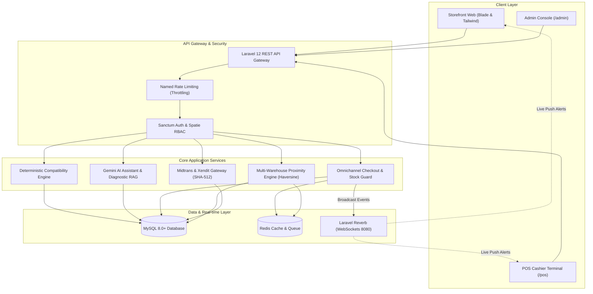

# MotoVault — Enterprise Smart Automotive Parts & Omnichannel Platform

[](https://laravel.com)
[](https://php.net)
[](https://tailwindcss.com)
[](https://laravel.com/docs/reverb)
[](https://ai.google.dev/)
[](tests)
[](LICENSE)

> **MotoVault** is an enterprise omnichannel e-commerce, multi-warehouse inventory management, and Point of Sale (POS) platform designed specifically for the automotive spare parts and accessories industry. It features a deterministic vehicle compatibility engine (Year-Make-Model-Trim), a consultative AI assistant powered by Google Gemini Tool Calling & Diagnostic RAG, and an event-driven real-time architecture built on Laravel Reverb.

---

## Table of Contents
- [Problem Statement & Solution](#problem-statement--solution)
- [Key Features](#key-features)
- [System Architecture](#system-architecture)
- [Tech Stack](#tech-stack)
- [Project Structure](#project-structure)
- [Installation & Getting Started](#installation--getting-started)
- [Demo Accounts & Quick Access](#demo-accounts--quick-access)
- [API Documentation](#api-documentation)
- [Automated Tests](#automated-tests)
- [License](#license)

---

## Problem Statement & Solution

### Industry Challenges
Purchasing automotive spare parts, oils, batteries, spark plugs, brake pads, and accessories frequently leads to purchase errors caused by technical specification mismatch. Key challenges include:
- E-commerce spare part return rates historically range between 12% and 18%.
- Stock discrepancies and race conditions between brick-and-mortar stores and online channels (overselling).
- Customer difficulty in troubleshooting and diagnosing motorcycle symptoms without workshop visits.

### The MotoVault Solution
1. **Deterministic Compatibility Engine:** Relational Year-Brand-Model-Trim matrix guarantees that every spare part purchased matches the customer's vehicle with 100% precision.
2. **AI Consultative Assistant (Zero Hallucination):** Gemini AI agent equipped with Function/Tool Calling accesses real-time catalog and inventory databases before providing purchase recommendations.
3. **Omnichannel & Multi-Warehouse POS:** Brick-and-mortar transactions (POS cashiers) and online orders synchronize bidirectionally with atomic concurrency control, augmented with Haversine proximity routing to fulfill orders from the nearest stocked facility.
4. **Auto-Release Stock Leak Prevention:** Unpaid orders automatically expire via scheduler within 30 minutes (TTL), returning reserved quantities back to active warehouse inventory.

---

## Key Features

### 1. Smart E-Commerce Storefront
- **Vehicle Garage Filter:** Filter the catalog dynamically by customer motorcycle make, model, and production year.
- **Multi-Variant Products:** Support for variant attributes such as specifications, capacity, dimensions, and types.
- **3PL Logistics Shipping Rates:** Real-time multi-courier shipping rate calculation based on weight, volume, and origin-destination proximity.
- **Midtrans Snap Payment:** Embedded checkout modal supporting QRIS, e-Wallets, Virtual Accounts, and Credit Cards.
- **Public Waybill Tracking:** Transparent public delivery tracking with courier milestone timeline.

### 2. Gemini AI Consultative Assistant & Diagnostic RAG
- **Tool Calling Execution:** Real-time tool execution (`search_products`, `check_compatibility`, `get_variant_stock`, `diagnose_symptom`).
- **Diagnostic RAG:** Matches user symptom descriptions (e.g., squeaking brakes, engine stutter, drained battery) to relevant replacement components using vector cosine similarity.
- **Streaming Response:** Server-Sent Events (SSE) stream (`/api/v1/ai/chat/stream`) for low-latency conversational UX.

### 3. In-Store Point of Sale (POS) Terminal
- **Fast Cashier Interface:** Instant SKU/Barcode lookup, category filtering, and responsive cart operations.
- **Direct Bill Checkout:** On-the-spot checkout supporting Cash, Store QRIS, and Bank Transfer with automated receipt generation.
- **Branch Warehouse Attribution:** Direct deduction from the specific physical store warehouse where the cashier operates.
- **Web Audio API Feedback:** Built-in audio chime synthesis for successful checkouts and incoming orders without external audio assets.

### 4. Multi-Warehouse Management & Logistics
- **Proximity Routing (Haversine Formula):** Automated routing algorithm selecting the closest warehouse containing sufficient stock.
- **Inter-Warehouse Stock Transfer:** End-to-end stock transfer lifecycle (*Requested* -> *Dispatched* -> *Received* / *Cancelled*).
- **Dual-Source Stock Synchronization:** Atomic consistency between global variant stock (`product_variants.stock`) and branch-level inventory (`warehouse_stocks.stock`).

### 5. Real-Time WebSocket Broadcasting (Laravel Reverb)
- **Live Notifications:** Instant push alerts to POS terminals and storefronts for new orders, payment status updates, and low-stock warnings.
- **Graceful Fallback:** Automatic degradation to REST polling intervals whenever WebSocket connectivity is interrupted.

### 6. Enterprise Security & Sales Analytics
- **Standardized Sales Export:** Export transaction summaries as RFC-4180 CSV with UTF-8 BOM encoding for seamless display in Microsoft Excel and Google Sheets.
- **Named Rate Limiting:** Granular throttling on sensitive endpoints (`ai-chat`, `auth`, `checkout`, `catalog`, `webhook`).
- **SHA-512 Digital Signature Verification:** Strict HMAC signature validation for Midtrans and callback token verification for Xendit webhooks with idempotent event recording.

---

## System Architecture



---

## Tech Stack

| Component | Technology | Description |
|---|---|---|
| **Backend Framework** | Laravel 12.x | PHP 8.2+ with RESTful architecture and domain service layer |
| **Frontend & UI** | Tailwind CSS v4, Vite 7, Blade | Modern responsive UI with dark/light visual accents |
| **Realtime Engine** | Laravel Reverb | High-performance WebSocket broadcasting server |
| **AI / LLM** | Google Gemini 2.0 Flash / OpenAI | Multi-turn function calling and Diagnostic RAG |
| **Database** | MySQL 8.0+ / SQLite | Multi-warehouse relations, compatibility pivot, indexed orders |
| **Cache & Queue** | Redis 7.0+ | Background job queues and cached catalog queries |
| **Payment Gateway** | Midtrans Snap & Xendit | SHA-512 signature hash verification and idempotent webhooks |
| **Authentication & RBAC** | Laravel Sanctum & Spatie Permission | Multi-role access control: Admin, Staff, Customer |
| **Testing** | PHPUnit 11.5 / Laravel Testing Suite | 80 Feature & Unit tests with 100% pass rate |

---

## Project Structure

```text
motovault/
├── app/
│   ├── Console/Commands/       # Artisan commands (orders:cancel-expired, etc.)
│   ├── Enums/                  # PHP enums (UserRole, OrderStatus, PaymentStatus, etc.)
│   ├── Events/                 # Broadcast events (OrderCreatedEvent, LowStockAlertEvent)
│   ├── Http/
│   │   ├── Controllers/Api/V1/ # REST API Controllers (Storefront, POS, Admin, AI)
│   │   ├── Middleware/         # Custom middleware and throttle handlers
│   │   └── Requests/Api/V1/    # Form requests and validation rules
│   ├── Models/                 # Eloquent models (Product, Vehicle, Warehouse, Order)
│   ├── Providers/              # Service providers and named rate limiters
│   └── Services/               # Domain Business Logic
│       ├── Ai/                 # Gemini Tool Calling, Embeddings, Diagnostic RAG
│       ├── Payment/            # Midtrans Snap and Xendit payment service
│       ├── Report/             # Sales report generator and CSV exporter
│       ├── Shipping/           # 3PL logistics and waybill generator
│       └── Warehouse/          # Proximity routing and stock transfer manager
├── config/                     # Service configurations (services, reverb, auth)
├── database/
│   ├── migrations/             # Database schema migrations
│   └── seeders/                # Seeders for RBAC, demo users, vehicles, and products
├── resources/
│   ├── js/                     # Frontend JS assets and Laravel Echo
│   ├── css/                    # Tailwind CSS v4 stylesheets
│   └── views/
│       ├── welcome.blade.php   # Storefront E-Commerce and Gemini AI Chat
│       ├── pos.blade.php       # In-Store Point of Sale (POS) Cashier Interface
│       └── admin/index.blade.php # Web Admin Management Console
├── routes/
│   ├── api.php                 # REST API v1 routes
│   ├── web.php                 # Web interface routes (Storefront, POS, Admin)
│   └── console.php             # Laravel Scheduler definitions
└── tests/                      # 80 Automated Feature & Unit Test Suites
```

---

## Installation & Getting Started

### 1. System Requirements
- PHP >= 8.2 (extensions: `pdo`, `mbstring`, `openssl`, `bcmath`, `curl`)
- Composer >= 2.5
- Node.js >= 18.x and NPM
- MySQL 8.0+ or PostgreSQL / SQLite
- Redis (optional for local development, recommended for production)

### 2. Clone the Repository
```bash
git clone https://github.com/LESOTOLE/retail.git
cd retail
```

### 3. Install PHP & JavaScript Dependencies
```bash
composer install
npm install
```

### 4. Configure Environment Variables
Copy the environment template file:
```bash
cp .env.example .env
php artisan key:generate
```

Configure your database and service credentials in `.env`:
```ini
DB_CONNECTION=mysql
DB_HOST=127.0.0.1
DB_PORT=3306
DB_DATABASE=motovault
DB_USERNAME=root
DB_PASSWORD=

# Gemini AI API (Obtain from Google AI Studio)
AI_DRIVER=gemini
GEMINI_API_KEY=your_gemini_api_key_here
GEMINI_MODEL=gemini-2.0-flash

# Midtrans Snap (Sandbox / Production)
PAYMENT_PROVIDER=midtrans
MIDTRANS_SERVER_KEY=your_midtrans_server_key
MIDTRANS_CLIENT_KEY=your_midtrans_client_key
MIDTRANS_IS_PRODUCTION=false

# Laravel Reverb (WebSocket)
BROADCAST_CONNECTION=reverb
REVERB_APP_ID=motovault-app
REVERB_APP_KEY=motovault-key
REVERB_APP_SECRET=motovault-secret
REVERB_HOST="127.0.0.1"
REVERB_PORT=8080
REVERB_SCHEME=http
```

### 5. Run Database Migrations & Seeders
```bash
php artisan migrate --seed
```

### 6. Build Frontend Assets
```bash
# For development (Vite development server)
npm run dev

# Or build for production
npm run build
```

### 7. Run Application Server & Workers
Start the primary application server:
```bash
php artisan serve
```

In separate terminal windows, start the WebSocket server and queue worker:
```bash
# Start WebSocket server
php artisan reverb:start

# Start Queue worker
php artisan queue:work

# (Optional) Run Scheduler to auto-cancel expired unpaid orders
php artisan schedule:work
```

---

## Demo Accounts & Quick Access

After running `php artisan db:seed`, the following accounts are available for testing:

| Persona / Role | Email | Password | Access URL | Primary Responsibilities |
|---|---|---|---|---|
| **Super Admin** | `admin@motovault.test` | `password` | `/admin` | Product Catalog, Compatibility Matrix, Warehouse Transfers, AI Logs |
| **Cashier (Staff)** | `staff@motovault.test` | `password` | `/pos` | Fast POS Checkout, Direct Billing, Low Stock Alerts, Sales Export |
| **Customer** | `customer@motovault.test` | `password` | `/` | Vehicle Filter, Parts Catalog, Gemini AI Consultation, Snap Checkout |

---

## API Documentation

All REST API endpoints are prefixed with `/api/v1` and return standardized JSON envelopes (`ApiResponse`).

### Public & Customer Endpoints
- `GET /api/v1/products` : Product catalog filtered by vehicle (`vehicle_id`) and category.
- `GET /api/v1/products/{slug}` : Detailed product data including variants and vehicle compatibility.
- `GET /api/v1/vehicles` : Master vehicle data (brands, models, production years).
- `POST /api/v1/cart/validate` : Validate stock availability for active cart items.
- `POST /api/v1/shipping/rates` : Calculate real-time 3PL courier shipping rates.
- `POST /api/v1/orders/checkout` : Create customer order and obtain Midtrans Snap token.
- `GET /api/v1/shipping/track/{waybill}` : Public waybill delivery status and tracking milestones.
- `POST /api/v1/ai/chat` : Consultative AI assistant with Gemini Function Calling.
- `POST /api/v1/ai/chat/stream` : Server-Sent Events (SSE) interactive AI chat stream.

### POS & Cashier Endpoints
- `POST /api/v1/pos/orders` : Direct point-of-sale transaction (Cash, QRIS, Transfer) with store-specific stock deduction.
- `GET /api/v1/notifications/recent` : Retrieve recent orders and critical low-stock alerts.

### Admin & Management Endpoints
- `POST /api/v1/admin/products` : Create new products and variants.
- `POST /api/v1/admin/products/{id}/compatibility` : Synchronize vehicle compatibility matrix.
- `GET /api/v1/admin/warehouses/transfers` : Monitor and manage inter-warehouse stock transfers.
- `GET /api/v1/admin/reports/sales` : Sales summary and analytics breakdown.
- `GET /api/v1/admin/reports/sales/export` : Download sales report in RFC-4180 CSV format.

### Payment Webhooks
- `POST /api/v1/webhooks/payment` : Handles automated payment notifications with SHA-512 signature validation and idempotent state transitions.

---

## Automated Tests

MotoVault includes a comprehensive test suite covering business logic, payment security, proximity routing, and end-to-end checkout flows.

Run the test suite using:
```bash
php artisan test
```

### Test Verification Summary:
```text
  Tests:    80 passed (658 assertions)
  Duration: ~65s
```

Core test coverage includes:
- **MidtransPaymentAndWebhookSecurityTest**: SHA-512 signature verification, rejection of tampered payloads, and webhook idempotency.
- **MultiWarehouseProximityTest**: Haversine distance ranking, nearest warehouse routing, and transfer rollbacks.
- **CancelExpiredOrdersTest**: 30-minute order TTL auto-cancellation and stock restitution.
- **AiChatApiTest & DiagnosticRagTest**: Gemini tool calling cycles, offline fallbacks, and cosine similarity vector matching.
- **RateLimiterApiTest**: HTTP 429 throttling verification on AI and authentication endpoints.
- **SalesReportExportTest**: RFC-4180 UTF-8 BOM CSV export structure and RBAC authorization barriers.
- **StorefrontEndToEndFlowTest**: End-to-end customer journey from vehicle selection to payment token issuance.

---

## License

This project is licensed under the open-source [MIT License](LICENSE). You are free to use, modify, and distribute it for both commercial and non-commercial purposes.
