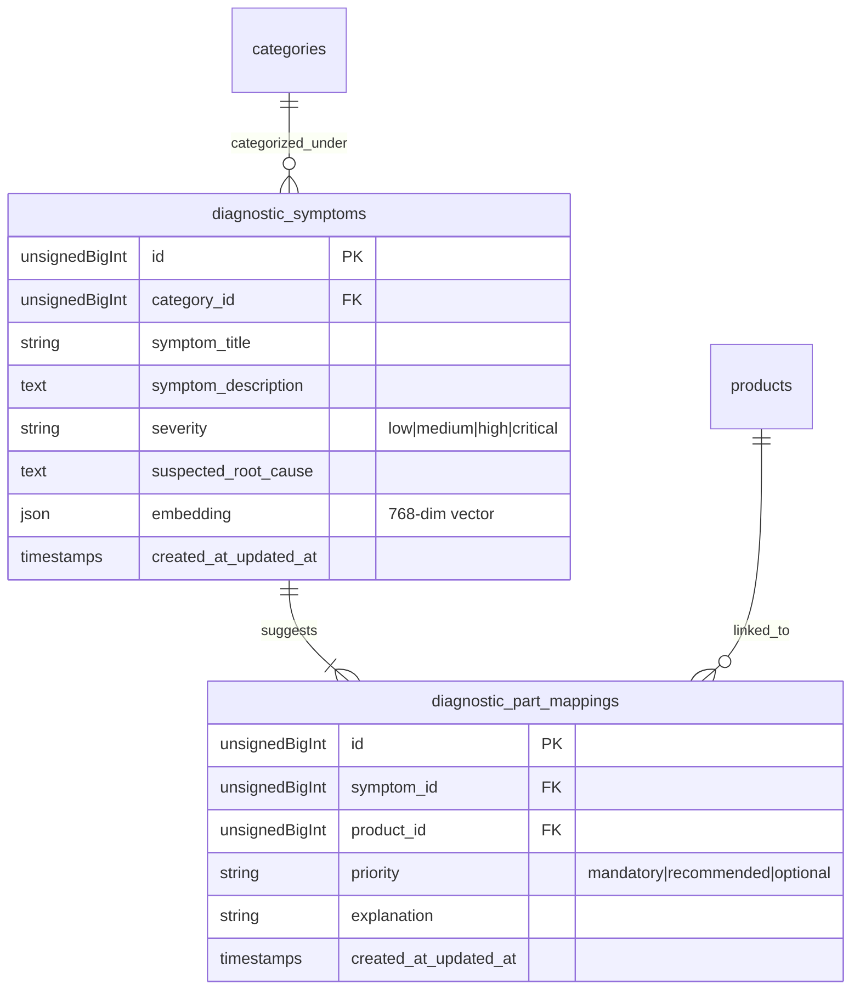
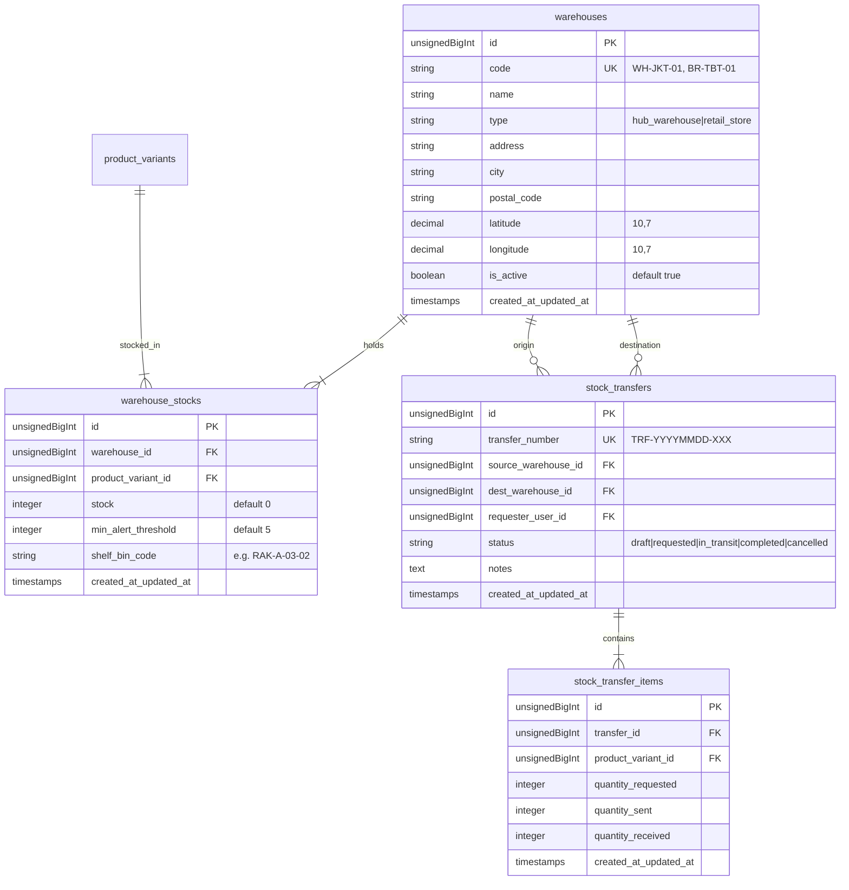
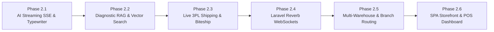

# Product Requirement Document (PRD) — Phase 2: Enterprise Expansion
**Project Name:** MotoVault (Smart Automotive Parts & Accessories Platform)  
**Version:** 2.0.0 (Enterprise Architecture Specification)  
**Target Tech Stack:** Laravel 11 (PHP 8.3+), Laravel Reverb (WebSockets), Redis 7+, Gemini 1.5/2.0 Streaming & Embeddings, Biteship / RajaOngkir Shipping API, Midtrans Snap, Vue 3 / React SPA  
**Document Status:** Approved & Ready for Phased Implementation  

---

## 1. Executive Overview & Scope of Expansion

Phase 1 MotoVault telah berhasil membangun fondasi *core backend*: Master Kendaraan, Matriks Kompatibilitas Deterministik, Inventaris Multi-Varian, Transaksi Atomik dengan *Pessimistic Locking*, Gemini Function Calling Assistant, dan RBAC Spatie.

Phase 2 mentransformasi MotoVault menjadi platform **Enterprise Omnichannel Otomotif Skala Nasional** melalui 6 modul tingkat lanjut:

```mermaid
graph TD
    subgraph Client Layer (Modul 6)
        C1[Customer E-Commerce SPA]
        C2[In-Store POS Terminal]
        C3[Admin & Warehouse Dashboard]
    end

    subgraph Real-Time & AI Core (Modul 1 & 2 & 5)
        A1[AI Streaming SSE Engine]
        A2[Semantic Diagnostic RAG & Vector Embeddings]
        A3[Laravel Reverb WebSocket Server]
    end

    subgraph Enterprise Commerce & Supply Chain (Modul 3 & 4)
        B1[3PL Multi-Courier Live Shipping Engine]
        B2[Multi-Warehouse & Branch Inventory Routing]
        B3[Inter-Branch Stock Transfer Engine]
    end

    subgraph External Gateways
        E1[Google Gemini AI / Embeddings API]
        E2[Biteship / RajaOngkir Logistics API]
        E3[Midtrans Snap / Xendit Payment Gateway]
    end

    Client Layer -->|SSE Stream / WebSocket| Real-Time & AI Core
    Client Layer -->|REST API| Enterprise Commerce & Supply Chain
    Real-Time & AI Core --> E1
    Enterprise Commerce & Supply Chain --> E2
    Enterprise Commerce & Supply Chain --> E3
```

---

## 2. Feature 1: AI Streaming SSE (Server-Sent Events) & Typewriter Effect

### 2.1. Problem & Objective
Respons AI standar (sinkron) memerlukan waktu 2–3 detik untuk menyelesaikan seluruh eksekusi tool calling dan generasi teks, yang dapat menimbulkan persepsi lambat (*latency perception*). AI Streaming SSE menurunkan *Time-To-First-Byte (TTFB)* menjadi `< 450ms` dan menghadirkan efek mengetik (*typewriter stream*) langsung ke layar pengguna.

### 2.2. Technical Architecture & Protocols
* **Protocol:** HTTP/1.1 or HTTP/2 Server-Sent Events (`text/event-stream`).
* **Headers:**
  ```http
  Content-Type: text/event-stream
  Cache-Control: no-cache
  Connection: keep-alive
  X-Accel-Buffering: no
  ```
* **Event Stream Packet Structure:**
  ```
  event: session
  data: {"session_token":"uuid-v4","vehicle_id":2}

  event: tool_start
  data: {"name":"search_products","arguments":{"query":"oli 10w40","vehicle_id":2}}

  event: tool_result
  data: {"count":3,"products":[{"sku":"MOT-10W40-1L","name":"Motul 10W-40 1L","price":133000,"stock":14}]}

  event: token
  data: {"text":"Untuk "}

  event: token
  data: {"text":"Vario 160 Anda, "}

  event: token
  data: {"text":"oli terbaik adalah Motul Scooter Power LE 10W-40."}

  event: product_recommendations
  data: [{"sku":"MOT-10W40-1L","name":"Motul Scooter Power LE 10W-40 1L","price":133000,"stock":14}]

  event: done
  data: {"status":"complete","driver":"gemini-streaming"}
  ```

### 2.3. API Endpoint Specification
* **Route:** `POST /api/v1/ai/chat/stream`
* **Request Payload:**
  ```json
  {
    "session_token": "optional-uuid",
    "vehicle_id": 2,
    "message": "Motor saya getar di stang, butuh spare part apa ya?"
  }
  ```
* **Response:** Streamed SSE Output.

---

## 3. Feature 2: RAG Semantic Search & Vector Embeddings for Symptom Diagnostics

### 3.1. Problem & Objective
Banyak pemilik kendaraan tidak mengetahui nama suku cadang teknis (misal: *Komstir*, *Roller CVT*, *Spool Pengapian*, *Seal Shockbreaker*). Konsumen sering mencari berdasarkan keluhan awam (misal: *"motor gredek pas nanjak"*, *"stang berat waktu belok"*, *"oli rembes dari shock depan"*). RAG Engine mencocokkan keluhan bahasa alami dengan basis data diagnosa otomotif menggunakan *Cosine Similarity* pada *Vector Embeddings*.

### 3.2. Database Schema & Data Model



### 3.3. Gemini Embedding & Vector Search Flow
1. User mengirim input: *"motor matic saya bergetar kasar saat awal gas di tanjakan"*.
2. Sistem meng-generate embedding via Gemini `text-embedding-004` (768 dimensi).
3. Query menghitung *Cosine Distance* terhadap tabel `diagnostic_symptoms`:
   $$\text{similarity} = \frac{\mathbf{A} \cdot \mathbf{B}}{\|\mathbf{A}\| \|\mathbf{B}\|}$$
4. Sistem mengambil *Top 3* gejala paling cocok (skor kemiripan $\ge 0.78$), memfilter produk suku cadang terkait yang kompatibel dengan motor pengguna, lalu menginjeksikannya sebagai konteks ke asisten AI.

---

## 4. Feature 3: Live 3PL Logistics & Shipping Rates (Biteship / RajaOngkir API)

### 4.1. Problem & Objective
E-commerce suku cadang memiliki variasi berat dan volume yang ekstrem (dari busi 50 gram hingga knalpot 6 kg dan helm full face 2 kg). MotoVault membutuhkan kalkulasi ongkos kirim multi-kurir otomatis yang memperhitungkan total gramasi, dimensi volumetrik, dan lokasi kecamatan/kelurahan tujuan.

### 4.2. Database Schema Additions

#### Modifikasi Tabel `products` & `product_variants`:
```sql
ALTER TABLE products ADD COLUMN weight_gram INT NOT NULL DEFAULT 200 AFTER base_price;
ALTER TABLE products ADD COLUMN length_cm DECIMAL(6,2) DEFAULT NULL AFTER weight_gram;
ALTER TABLE products ADD COLUMN width_cm DECIMAL(6,2) DEFAULT NULL AFTER length_cm;
ALTER TABLE products ADD COLUMN height_cm DECIMAL(6,2) DEFAULT NULL AFTER width_cm;
```

#### Tabel `shipping_orders` (Logistik & AWB):
```
shipping_orders
 ├── id (PK, unsignedBigInt)
 ├── order_id (FK -> orders.id, unique)
 ├── courier_code (varchar: 'jne', 'jnt', 'sicepat', 'gosend')
 ├── courier_service (varchar: 'REG', 'YES', 'BEST', 'Instant')
 ├── waybill_number (varchar, nullable - Nomor Resi Asli)
 ├── tracking_status (varchar: 'ready_to_ship', 'in_transit', 'delivered', 'returned')
 ├── shipping_cost (decimal: 12,2)
 ├── insurance_cost (decimal: 12,2, default: 0)
 ├── origin_postal_code (varchar: 10)
 ├── destination_postal_code (varchar: 10)
 ├── raw_tracking_history (json, nullable)
 └── timestamps
```

### 4.3. API Contract
* `POST /api/v1/shipping/rates`: Menghitung tarif ongkir instan dari semua ekspedisi.
* `POST /api/v1/shipping/create-pickup`: Memicu order pickup kurir otomatis via webhook Biteship.
* `GET /api/v1/shipping/track/{order_number}`: Menampilkan riwayat perjalanan resi real-time (*milestones*).

---

## 5. Feature 4: Real-Time WebSockets via Laravel Reverb

### 5.1. Problem & Objective
Menghilangkan mekanisme polling yang membebani server dan menyajikan notifikasi instan:
* Kasir offline menerima notifikasi saat ada pesanan online baru yang perlu disiapkan di tokonya.
* Customer menerima update instan saat pembayaran diverifikasi atau saat kurir bergerak.
* Admin gudang menerima peringatan langsung (*toast alert*) saat ada varian yang stoknya habis.

### 5.2. Architecture & Channel Map

| Channel Name | Channel Type | Authorization | Broadcast Event |
|---|---|---|---|
| `private-user.orders.{userId}` | Private | Customer Only | `OrderPaidEvent`, `OrderShippedEvent`, `OrderDeliveredEvent` |
| `presence-store.{warehouseId}` | Presence | Staff & Cashier | `NewInStoreOrderAlert`, `StaffOnlinePresence` |
| `private-admin.inventory` | Private | Admin / Warehouse | `StockDepletedAlert`, `StockTransferRequested` |
| `public-stock.variant.{sku}` | Public | Public | `VariantStockChanged` (Live Cart stock badge) |

---

## 6. Feature 5: Multi-Branch & Multi-Warehouse Inventory Management

### 6.1. Problem & Objective
MotoVault yang beroperasi di berbagai lokasi cabang toko fisik dan gudang distribusi pusat memerlukan isolasi stok per lokasi, pemilihan gudang terdekat (*Nearest Warehouse Proximity Routing*), dan mekanisme mutasi stok antar-cabang (*Inter-Branch Stock Transfer*).

### 6.2. Database Schema & Data Dictionary



### 6.3. Smart Fulfillment Routing Engine
Saat pelanggan checkout dengan alamat pengiriman $(lat_c, long_c)$:
1. Query menghitung jarak menggunakan rumus *Haversine* ke seluruh cabang yang memiliki `stock >= quantity`:
   $$d = 2r \arcsin\left(\sqrt{\sin^2\left(\frac{\Delta lat}{2}\right) + \cos(lat_1)\cos(lat_2)\sin^2\left(\frac{\Delta long}{2}\right)}\right)$$
2. Memilih cabang terdekat dengan ketersediaan stok lengkap untuk meminimalkan ongkir dan waktu pengiriman.

---

## 7. Feature 6: Full-Featured Frontend SPA & Admin/POS Dashboard

### 7.1. Three-Tier Frontend App Structure

```
motovault-frontend/
├── apps/
│   ├── storefront/             # Customer Web E-Commerce (Next.js / Vue 3)
│   │   ├── components/garage/  # Vehicle Switcher Drawer & Garage Selector
│   │   ├── components/ai/      # AI Floating Chat Drawer with SSE Stream & Audio
│   │   ├── components/catalog/ # Product Filter Matrix & Compatibility Badges
│   │   └── components/checkout/# Multi-Courier Shipping & Midtrans Snap Modal
│   ├── pos-terminal/           # In-Store Cashier POS App (Tailwind + Pinia)
│   │   ├── views/Cashier.vue   # Barcode Scan Fast-Billing & Thermal Printer
│   │   └── views/StockCheck.vue# In-Store Physical Shelf Locator
│   └── admin-portal/           # Super Admin & Warehouse HQ (Inertia.js / React)
│       ├── views/MatrixEditor  # Mass Vehicle Compatibility Mapping Tool
│       ├── views/Transfers     # Inter-Branch Stock Transfer Dispatcher
│       └── views/AiAudit       # AI Conversation Analytics & Conversion Funnel
└── packages/
    └── api-client/             # Generated TypeScript SDK & Reverb WebSocket client
```

### 7.2. POS Cashier Mode Capabilities
* **Barcode Scanner Autofocus:** Input SKU/EAN otomatis mendeteksi varian dalam `< 50ms`.
* **Thermal Receipt Printing:** Cetak struk kasir via *Web Bluetooth / Web Serial API* (format 58mm & 80mm ESC/POS).
* **Split Payment:** Mendukung kombinasi Tunai + QRIS dalam 1 invoice kasir.

---

## 8. Implementation Roadmap (Phases 2.1 – 2.6)



| Fase | Target Modul | Deliverables Kunci | Estimasi Test Coverage |
|---|---|---|---|
| **Phase 2.1** | AI Streaming SSE | Endpoint `POST /api/v1/ai/chat/stream`, Gemini streaming chunk parser, client stream reader. | Feature SSE test + buffer timeout test |
| **Phase 2.2** | RAG Diagnostic Engine | Tabel `diagnostic_symptoms`, Gemini `text-embedding-004` service, Cosine similarity query, AI diagnostic tool. | Semantic accuracy test (Golden 20 symptoms) |
| **Phase 2.3** | Live 3PL Shipping | Dimensi gramasi produk, `ShippingRateService`, integrasi multi-ekspedisi, AWB tracking webhook. | Mocked Biteship rate & tracking tests |
| **Phase 2.4** | Laravel Reverb WebSockets | Setup Reverb Server, private channels, `OrderCreatedEvent`, broadcast live alert kasir. | WebSocket handshake & event dispatch test |
| **Phase 2.5** | Multi-Warehouse & Routing | Tabel `warehouses`, `warehouse_stocks`, `stock_transfers`, Haversine routing engine. | Inter-warehouse locking & transfer tests |
| **Phase 2.6** | Full SPA & POS Terminal | Storefront customer, POS thermal cashier view, Admin compatibility matrix dashboard. | E2E Cypress/Playwright workflows |
