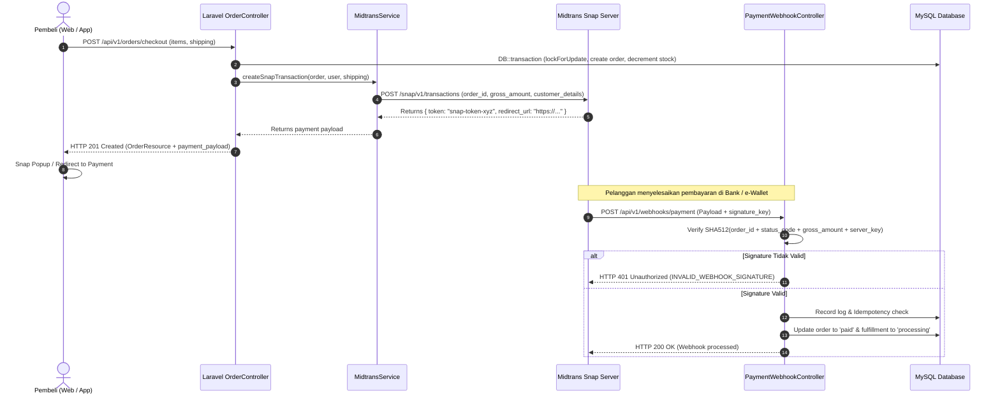

# Product Requirement Document (PRD) — Midtrans Payment Gateway, Webhook Security & API Rate Limiting
**Project Name:** MotoVault (Smart Automotive Parts & Omnichannel Platform)  
**Document Version:** 1.0.0  
**Target Tech Stack:** Laravel 12 (PHP 8.2+), Midtrans Snap API v1 / Core API, Redis / Cache Rate Limiting, Sanctum Auth  
**Status:** Approved & Ready for Implementation  

---

## 1. Executive Summary & Problem Statement

### 1.1. Background & Problem Statement
MotoVault saat ini telah memiliki alur checkout yang atomik dengan *pessimistic locking* (`SELECT ... FOR UPDATE`), namun sistem transaksi pembayarannya masih menghadapi tiga masalah krusial:
1. **Payment Gateway Masih Bersifat Mock (Simulasi Lokal):**
   Checkout saat ini hanya menyimpan status `unpaid` ke database dan menampilkan simulasi statis SVG QRIS dan nomor rekening BCA VA dummy. Pelanggan belum memperoleh *Snap Token* atau *Payment Redirect URL* resmi dari payment gateway (Midtrans).
2. **Celah Keamanan Webhook Pembayaran (Critical Vulnerability):**
   Endpoint `POST /api/v1/webhooks/payment` saat ini mencatat notifikasi dan langsung mengubah status order menjadi `paid` tanpa memverifikasi *digital signature* HMAC SHA-512 dari Midtrans atau callback token dari Xendit. Hal ini membuka celah fatal di mana penyerang dapat menembak endpoint webhook dengan payload palsu dan melunasi order tanpa melakukan pembayaran nyata.
3. **Ketiadaan Pembatasan Laju Request (API Rate Limiting Gaps):**
   Endpoint publik sensitif seperti `/api/v1/ai/chat`, `/api/v1/auth/login`, dan `/api/v1/orders/checkout` belum dipasangi middleware `throttle`. Ini menimbulkan risiko eksploitasi kuota Google Gemini API, serangan brute-force password, dan spamming checkout.

### 1.2. Scope of Solution
Dokumen ini mendefinisikan spesifikasi untuk 3 pilar perbaikan:
1. **Integrasi Midtrans Snap API Resmi:** Layanan `MidtransService` yang memanggil endpoint Snap API untuk menerbitkan `snap_token` dan `redirect_url` saat checkout, dilengkapi *graceful sandbox/mock fallback* jika API key belum diatur.
2. **Pengamanan Webhook Digital Signature (HMAC SHA-512):** Verifikasi signature matematis anti-spoofing sebelum webhook log diproses atau status pesanan diperbarui.
3. **Implementasi Named API Rate Limiting:** Konfigurasi rate limiter di `AppServiceProvider` dan penerapan middleware `throttle` di seluruh rute API sensitif sesuai standar NFR PRD v1.1.0.

---

## 2. Technical Architecture & Workflows

### 2.1. End-to-End Payment & Webhook Lifecycle



---

## 3. Detailed Functional Specifications

### 3.1. Feature 1: Midtrans Snap Gateway Integration (`MidtransService`)

#### A. Konfigurasi (`config/services.php`)
Sistem menggunakan konfigurasi standar Midtrans:
```php
'midtrans' => [
    'server_key' => env('MIDTRANS_SERVER_KEY'),
    'client_key' => env('MIDTRANS_CLIENT_KEY'),
    'is_production' => (bool) env('MIDTRANS_IS_PRODUCTION', false),
    'snap_url' => env('MIDTRANS_IS_PRODUCTION', false)
        ? 'https://app.midtrans.com/snap/v1/transactions'
        : 'https://app.sandbox.midtrans.com/snap/v1/transactions',
],
```

#### B. Service Class: `App\Services\Payment\MidtransService`
* **Tanggung Jawab:**
  1. Membangun payload transaksi Snap:
     * `transaction_details`: `order_id` (nomor order unik) dan `gross_amount` (dibulatkan ke integer).
     * `item_details`: Rincian seluruh varian produk yang dibeli + baris ongkos kirim ekspedisi.
     * `customer_details`: `first_name`, `email`, `phone`, `shipping_address`.
     * `callbacks`: URL redirect setelah pembayaran selesai atau dibatalkan.
  2. Mengirimkan HTTP Request ke Midtrans Snap API menggunakan Basic Auth (`base64_encode(SERVER_KEY . ':')`).
  3. **Graceful Fallback Mode:**
     * Bila `MIDTRANS_SERVER_KEY` tidak diatur (lingkungan testing lokal/offline), service secara otomatis menerbitkan mock token `mock-snap-token-{order_number}` dan redirect URL dummy tanpa membuat checkout gagal atau error 500.

#### C. Integrasi Checkout Controller & Resource
* Di [`OrderController::checkout`](file:///D:/project/motovault/app/Http/Controllers/Api/V1/OrderController.php):
  Panggil `MidtransService::createSnapTransaction($order)` dan sertakan hasilnya ke dalam respons envelope `data.payment_payload`:
  ```json
  {
    "order_number": "ORD-20260921-0001",
    "total_amount": 350000,
    "payment_status": "unpaid",
    "payment_payload": {
      "snap_token": "a1b2c3d4-xxxx-xxxx-xxxx-xxxxxxxxxxxx",
      "redirect_url": "https://app.sandbox.midtrans.com/snap/v2/vtweb/a1b2c3d4",
      "client_key": "SB-Mid-client-xxxx"
    }
  }
  ```

---

### 3.2. Feature 2: Webhook Digital Signature Verification (HMAC SHA-512)

#### A. Algoritma Verifikasi Signature
Midtrans mengirimkan `signature_key` di dalam JSON payload. Nilai signature resmi dihitung dengan rumus:
$$\text{CalculatedSignature} = \text{hash}('sha512', \text{order\_id} + \text{status\_code} + \text{gross\_amount} + \text{ServerKey})$$

Untuk Xendit (apabila provider = xendit), validasi dilakukan melalui perbandingan header `x-callback-token` dengan `config('services.xendit.callback_token')`.

#### B. Aturan & Siklus Hidup Webhook di `PaymentWebhookController`
1. Baca payload dan provider (`X-Payment-Provider` header atau default `midtrans`).
2. **Validasi Signature:**
   * Ambil `order_id`, `status_code`, `gross_amount`, dan `signature_key` dari request.
   * Hitung hash SHA-512 menggunakan `MIDTRANS_SERVER_KEY`.
   * Bandingkan menggunakan `hash_equals($calculatedSignature, $requestSignature)`.
   * Bila tidak cocok (dan server key terkonfigurasi): tolak dengan HTTP 401 `INVALID_WEBHOOK_SIGNATURE`.
   * Jika server key kosong (mode testing/lokal), lakukan bypass dengan peringatan log.
3. **Idempotency Check:**
   * Cek duplikasi event pada tabel `payment_webhook_logs` via `event_key` unik (`provider:transaction_id:status`).
   * Bila sudah pernah diproses (`is_processed = true`), kembalikan HTTP 200 langsung tanpa memproses ulang.
4. **State Machine Transition:**
   * `settlement`, `capture` (dengan `fraud_status == accept`), `paid`, `SUCCESS`: Panggil `$checkoutService->markAsPaid($order, $paymentRef)`.
   * `cancel`, `deny`, `expire`, `EXPIRED`, `FAILED`: Panggil `$checkoutService->cancel($order, $paymentStatus)` untuk merilis dan mengembalikan kuantitas stok varian.

---

### 3.3. Feature 3: API Rate Limiting & Throttling Policies

Sesuai standar PRD Bagian 8.3, pasang pembatasan laju kueri menggunakan `RateLimiter` Laravel:

| Identifier Rate Limiter | Batas Maksimum | Scope / Kunci | Rute Sasaran |
|---|---|---|---|
| `ai-chat` | 15 request / menit | IP atau User ID | `POST /api/v1/ai/chat`<br/>`POST /api/v1/ai/chat/stream` |
| `auth` | 10 request / menit | IP Address | `POST /api/v1/auth/login`<br/>`POST /api/v1/auth/register` |
| `catalog` | 120 request / menit | IP Address | `GET /api/v1/products`<br/>`GET /api/v1/products/{slug}`<br/>`GET /api/v1/vehicles` |
| `checkout` | 10 request / menit | User ID / IP | `POST /api/v1/orders/checkout` |
| `webhook` | 60 request / menit | IP Address | `POST /api/v1/webhooks/payment` |

Respon standar saat rate limit terlampaui (HTTP 429 Too Many Requests):
```json
{
  "success": false,
  "message": "Terlalu banyak permintaan. Silakan tunggu beberapa saat.",
  "data": null,
  "errors": null,
  "error_code": "TOO_MANY_REQUESTS"
}
```

---

## 4. Frontend Integration (`welcome.blade.php`)

1. **Midtrans Snap Script Loader:**
   * Muat script CDN Midtrans Snap Sandbox: `<script src="https://app.sandbox.midtrans.com/snap/snap.js" data-client-key="{{ config('services.midtrans.client_key') }}"></script>`.
2. **Aksi Tombol Pembayaran di Modal Sukses:**
   * Ketika `payment_payload.snap_token` tersedia:
     * Tampilkan tombol interaktif **"Bayar Sekarang (Snap Gateway)"**.
     * Eksekusi `window.snap.pay(snapToken, { onSuccess: ..., onPending: ..., onError: ... })`.
     * Tampilkan link alternatif **"Buka Halaman Pembayaran Midtrans →"** yang mengarah ke `redirect_url`.

---

## 5. Testing & Verification Criteria

1. **Unit & Service Tests:**
   * `MidtransServiceTest`: Payload generator menghasilkan JSON terstruktur valid sesuai spesifikasi Midtrans. Fallback mock token aktif saat key kosong.
2. **Feature Tests:**
   * `CheckoutSnapPayloadTest`: `POST /api/v1/orders/checkout` mengembalikan envelope yang menyertakan `payment_payload` dengan `snap_token` dan `redirect_url`.
   * `PaymentWebhookSecurityTest`:
     * Valid SHA-512 signature mengembalikan HTTP 200 dan melunasi pesanan.
     * Tampered / Invalid signature ditolak dengan HTTP 401 `INVALID_WEBHOOK_SIGNATURE`.
     * Request webhook berulang ditangani secara idempoten (HTTP 200 tanpa duplikasi mutasi).
   * `RateLimiterApiTest`:
     * Request ke-16 dalam 1 menit ke `/api/v1/ai/chat` menerima HTTP 429.
     * Request ke-11 dalam 1 menit ke `/api/v1/auth/login` menerima HTTP 429.
3. **Regression Safety:** Seluruh 59 test yang ada sebelumnya harus tetap 100% PASS.
